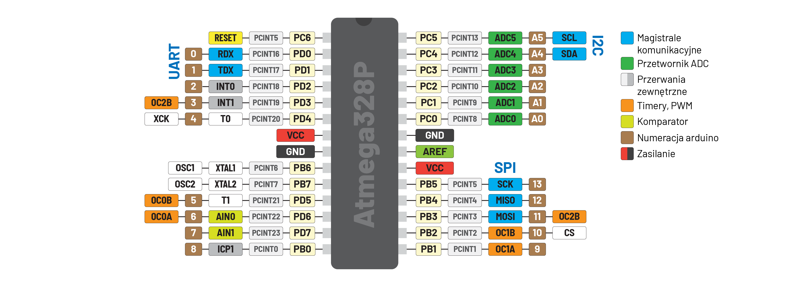

# Inteligentny Kurnik

Dopiero początek projektu ~~[TODO](./todo.md)~~

Inteligentny kurnik to projekt który symuluje dzień i noc. Główne funkcje naszego programu:
- Sterowanie oświetleniem symulującym słońce
- płynne rozświetlanie i gaszenie lamp
- ~~możliwość ustawienia długości doby~~
- sygnał sterujący do sterowani drzwiami
  
  ## Lider grupy
    Liderem grupy jest Andrzej Szyler 
  
   Przedstawiony przez nas inteligentny kurnik pracuje w oparciu o 8-bitowy kontroler AVR Atmega328P z 32-kilobajtami pamięci flash.
  Jest obsługiwany przez kod oparty na środowisku Visual Studio Code w języku C.
  
    
    ATmega328P

  
    ## Wyjścia i wejścia cyfrowe

    ### Wejścia:
    
    -PB5(SCK)\
    -PB4(MOSI)\
    -PB3(MISO)\
    -PB2(CS)\
    -PD0(SW)\
    -PD1(SW)\
    }(Zegar odmierzający dobę)\
    -PD0 (W połączeniu z diodą LED0 sygnalizuje czy kurnik jest zamknięty bądź otwarty)

    ### Wyjścia
    -PD2->LED0\
    -PD3->LED1\


    ## Kod
  
    ```c
    #define __AVR_ATmega328P__
#define F_CPU 16000000

#include <avr/io.h>
#include <util/delay.h>

int main(void)
{
 PORT_Init();
 PORT_Start();
 int x=0, y=18; // x to wartość sterująca oświetleniem, y to wartość temperatury
 
  DDRD &= ~0x03;//Deklaracja wejść (Przyciski) PD0 i PD1
  DDRB &= ~0x3C; //Deklaracja wejść dla wyświetlacza [PB2...PB5]
  PORTD |= 0x03; //Rezystory dla wejść [PD0,PD1]
  DDRD |= 0x0C //Deklaracja wyjść [PD2,PD3]

  while(1){
  for(int j=0;j<24;j++){ //Pętla symulująca 24h zegar
  for(int i=0;i<60;i++){
    if(~PIND& (1<<0)){ //Przycisk otwierający furtkę podłączony do wejścia PD0
PORTD |= (1 << 2); 
}else{
  PORTD &= ~(1 << 2);
}
 if(~PIND & (1<<1)){   //Po wciśnięciu przycisku (wejście PD1) zamiast zegara na wyświetlaczu pojawia się temperatura
 SEG7_Int(y);
 }else{
SEG7_Sign(0, j, false);
SEG7_Sign(2, i, false); //Wyświetla godzinę na wyświetlaczu
 }
if(j>=6&&x!=60&&j<18){ //Zapala światło między godziną 6:00 a 18:00
x=2*i;
PWM_SetA(x); // Sterowanie oświetleniem
if(y==18){
y=y+5;
}
}
if(j>=18&&x!=0&&j<6){ //Gasi światło pomiędzy 18:00 a 6:00
x=60-2*i;
PWM_SetA(x);
if(y!=18){
y=y-5; //zmniejsza temperaturę na noc
}
_delay_ms(288); //czas trwania jednej minuty w symulacji


  
      }

     }
    }
  }
}


    ```

